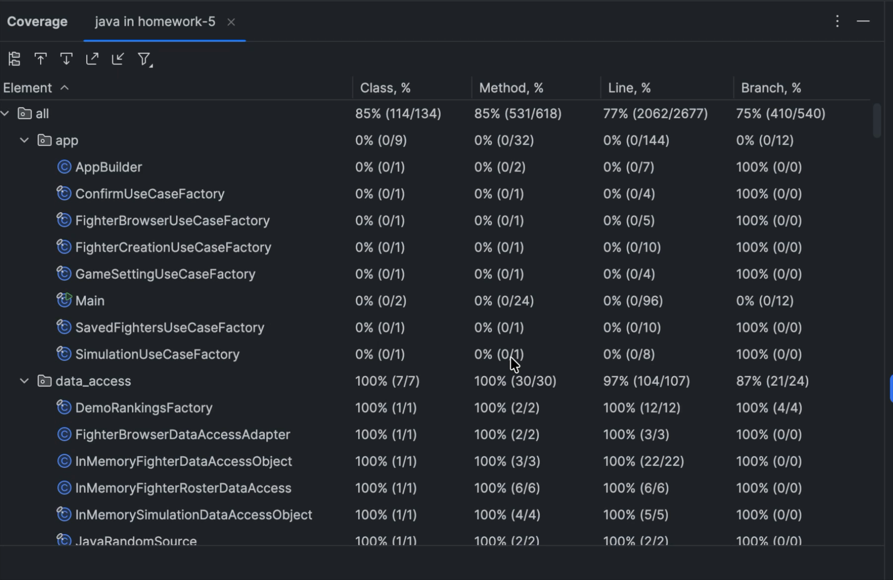

# Test Coverage

- Tests: 99 run, 0 failures, 0 errors, 0 skipped
- Overall line coverage: 2,062 / 2,677 (77%)
- Overall branch coverage: 410 / 540 (75%)
- Use-case package line coverage: 621 / 636 (97%)
- Use-case package branch coverage: 180 / 207 (87%)

